<div align="center">

# TrueNAS Prometheus Exporter

Standalone Prometheus exporter for the TrueNAS JSON-RPC WebSocket API, with Docker-first deployment, safe metric defaults, and an included Grafana dashboard.


[Quick start](#quick-start) • [Configuration](#configuration) • [Grafana dashboard](#grafana-dashboard) • [Testing](#testing)

</div>

Repository: `github.com/Unknowlars/truenas-scale-api-prometheus-exporter`

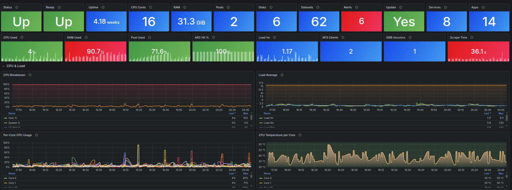

## Dashboard Preview

The repository includes a ready-to-import Grafana dashboard covering system health, storage pools, disks, ZFS cache, services, apps, tasks, alerts, and virtualization.

| System & Performance | Memory |
| --- | --- |
|  | 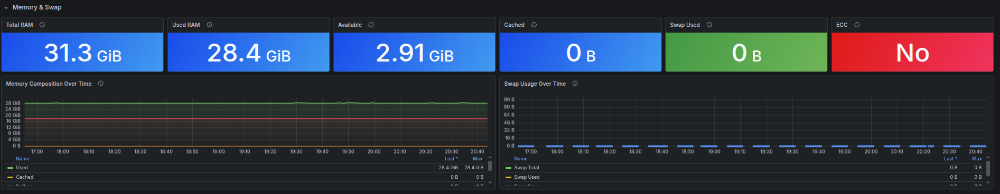 |

| Storage and Pools | Storage Deep Dive |
| --- | --- |
| 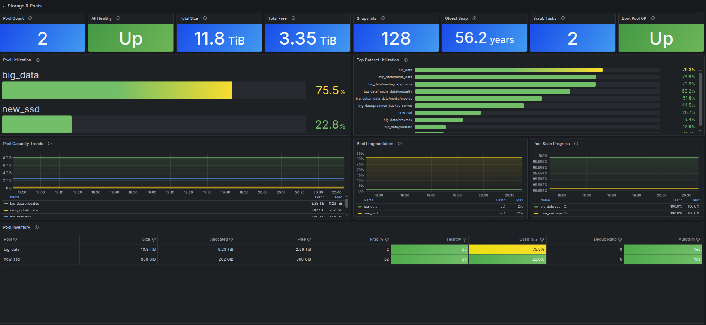 | 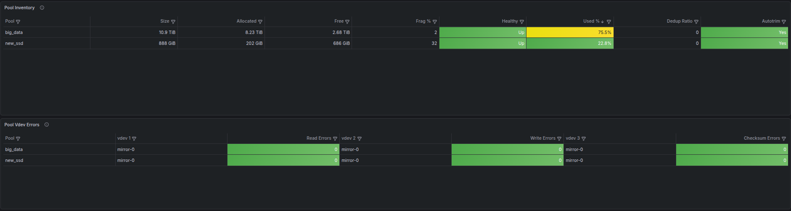 |

| Dataset Deep Dive | Disks and Temperatures |
| --- | --- |
| 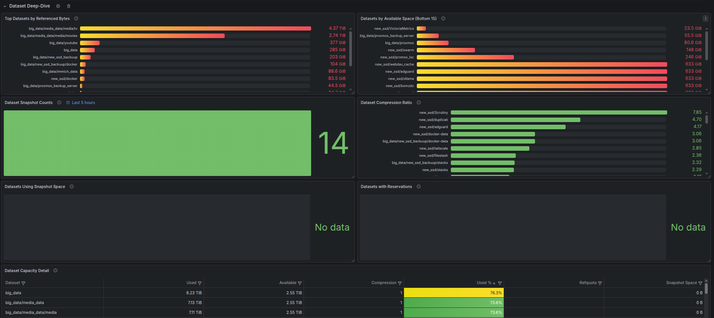 | 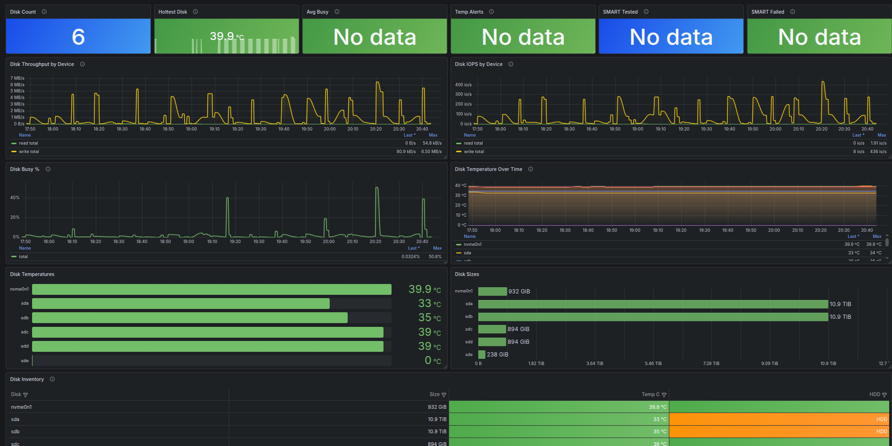 |

| ZFS ARC Cache | Network Interfaces |
| --- | --- |
| 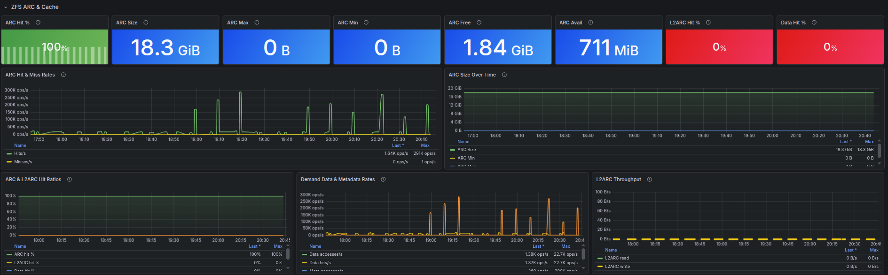 | 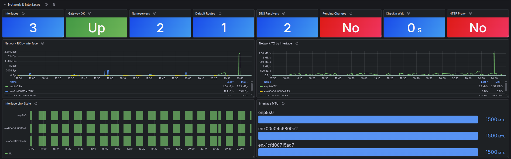 |

| Services and Shares | Apps and Docker |
| --- | --- |
| 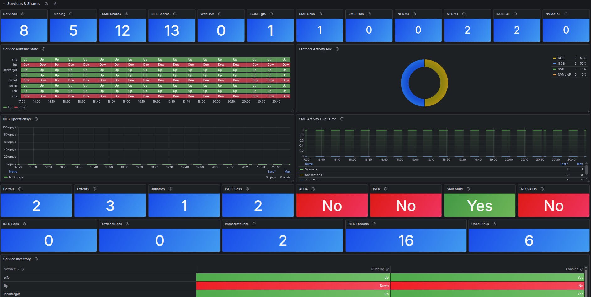 | 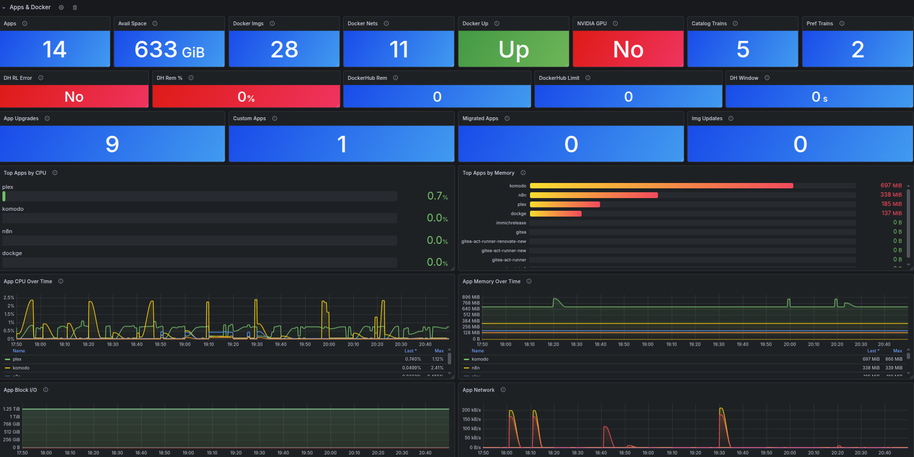 |

| Apps and Docker (Details) | Virtualization |
| --- | --- |
| 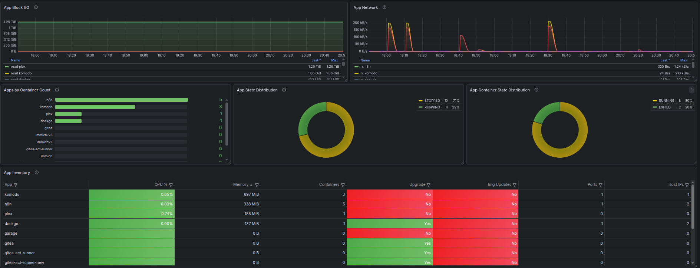 | 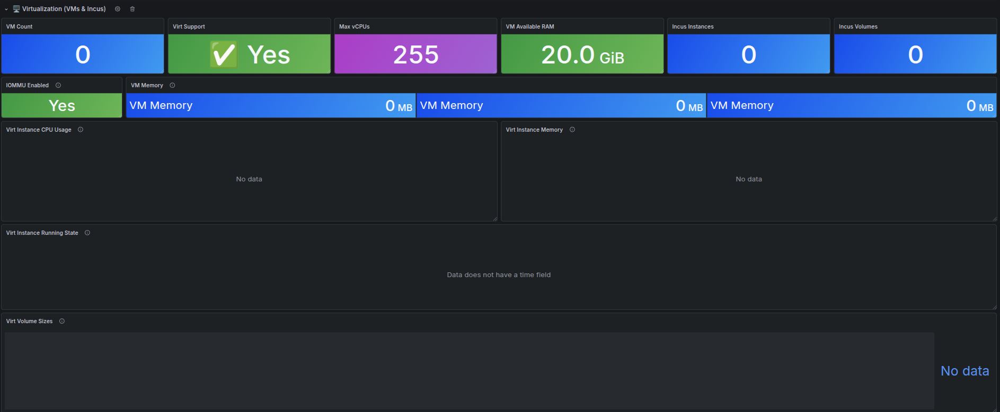 |

| Alerts, Tasks, and Updates | Audit and Directory Services |
| --- | --- |
| 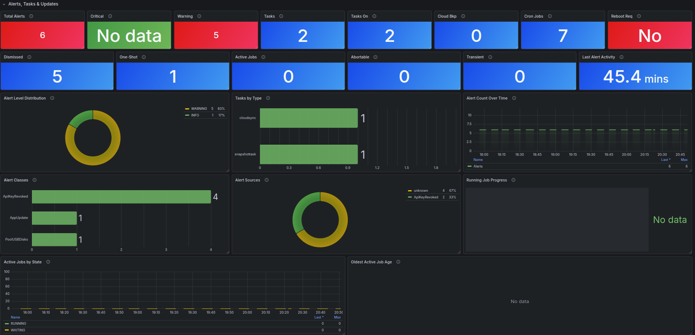 | 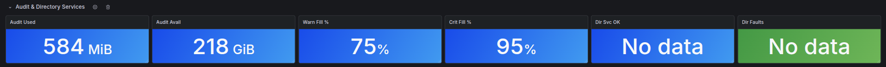 |

| Security and Platform | System Configuration |
| --- | --- |
| 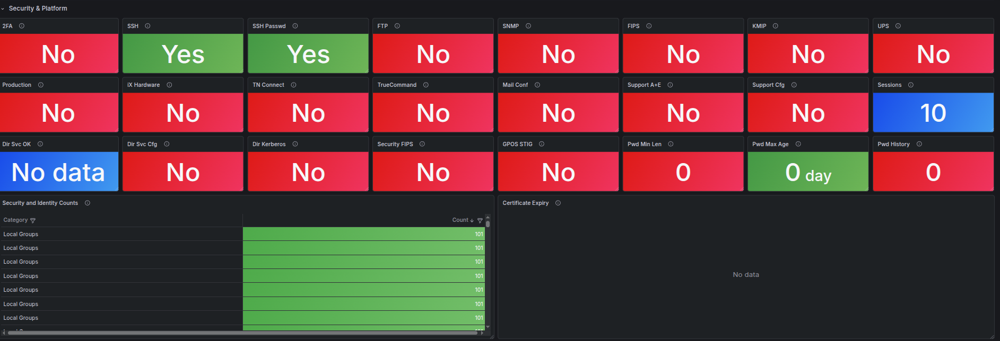 | 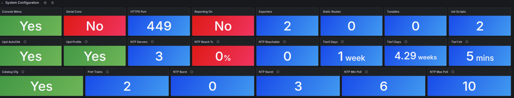 |

| Advanced Protocols, NVMe-oF, FC, and HA | Boot Environment |
| --- | --- |
| 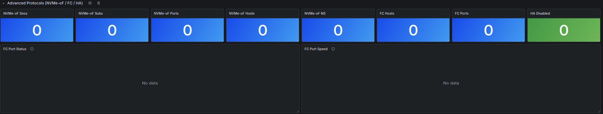 | 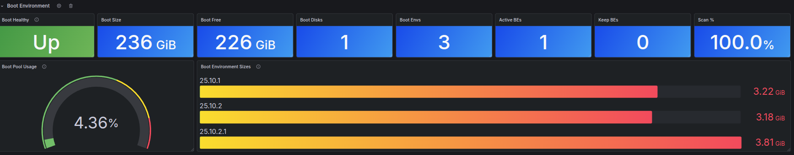 |

> [!IMPORTANT]
> This exporter was built mostly by AI over a few weeks running on my own truenas setup, its read only and follow the truenas API docs i have made a script to convert to markdown files in docs

## Overview

TrueNAS Prometheus Exporter connects to a TrueNAS system over the JSON-RPC WebSocket API, collects inventory and state data, and exposes Prometheus metrics on `/metrics` with a lightweight `/healthz` endpoint for container health checks.

It is designed to be easy to run publicly and easy to operate:

- single-file Python exporter with minimal runtime dependencies
- Docker and Docker Compose friendly out of the box
- broad metric coverage across storage, hardware, services, tasks, and alerts
- event-driven realtime updates for streams such as `reporting.realtime`, `app.stats`, and `virt.instance.metrics`
- bundled Grafana dashboard JSON and dashboard generator source
- conservative defaults that keep higher-cardinality options disabled unless you opt in

See `docs/exporter-metric-expansion-plan.md` for the current dedicated-metric roadmap.

> [!IMPORTANT]
> This exporter is currently maintained against TrueNAS SCALE `25.10.2`. Nearby versions may work, but collector coverage and default event subscriptions are tuned for that release.

## What You Get

- system identity, version, uptime, readiness, update, and reboot state
- pools, datasets, snapshots, scrub and resilver progress, and vdev errors
- CPU, memory, swap, disks, temperatures, network throughput, and ZFS ARC/L2ARC metrics
- SMB, NFS, iSCSI, NVMe-oF, services, apps, VMs, jobs, replication, and alerts
- dedicated coverage for DockerHub pull limits, VM capability flags, directory services config, security posture, support state, update profiles, NTP health rollups, catalog preferences, iSCSI session features, and reporting retention
- exporter health signals such as API call failures and collector error counters

## Quick Start

If you are new to Prometheus exporters, start with Option 1 and follow the beginner checklist right after it.

### Option 1: Docker Compose

This is the fastest way to get the exporter running locally.

```bash
cp .env.example .env
# Edit .env and set TRUENAS_WS_URL and TRUENAS_API_KEY
docker compose up -d --build
curl http://localhost:9108/healthz
curl http://localhost:9108/metrics
```

Compose reads `.env` and publishes `EXPORTER_PORT` on the same host port by default.

### Beginner Setup Checklist (Docker Compose)

1. On your TrueNAS system, create a read-only API key.
   Expected result: the key is created and visible in the TrueNAS API key list.
2. In this repo, run `cp .env.example .env`.
   Expected result: a new `.env` file exists in the project root.
3. Edit `.env` and set `TRUENAS_WS_URL` to your TrueNAS WebSocket endpoint (for example `wss://truenas.example.local/api/current`).
   Expected result: `TRUENAS_WS_URL` points to `/api/current` and has no placeholder value.
4. Set `TRUENAS_API_KEY` in `.env`.
   Expected result: `.env` contains your key and no spaces around `=`.
5. Start the exporter with `docker compose up -d --build`.
   Expected result: `docker compose ps` shows the `truenas-exporter` container as running.
6. Confirm the exporter is healthy at `http://localhost:9108/healthz`.
   Expected result: the endpoint returns `ok`.
7. Confirm metrics are exposed at `http://localhost:9108/metrics`.
   Expected result: output starts with Prometheus text such as `# HELP` and includes `truenas_up`.
8. Add a scrape config in Prometheus (or Grafana Alloy) and verify series appear.
   Expected result: querying `truenas_up` returns `1` for your exporter target.

### Option 2: Docker Image

Run the published container directly:

```bash
cp .env.example .env
docker pull ghcr.io/unknowlars/truenas-scale-api-prometheus-exporter:latest
docker run --rm \
  --env-file .env \
  -p 9108:9108 \
  ghcr.io/unknowlars/truenas-scale-api-prometheus-exporter:latest
```

If you want to build the image locally instead, use:

```bash
docker build -t ghcr.io/unknowlars/truenas-scale-api-prometheus-exporter:latest .
```

### Option 3: Run Locally with Python

```bash
python3 -m venv .venv
. .venv/bin/activate
pip install -r requirements.txt
cp .env.example .env
python3 truenas_exporter.py
```

## Configuration

Everything supported by the exporter is documented in `.env.example`. These are the settings most users will care about first:

| Variable | Required | Description |
| --- | --- | --- |
| `TRUENAS_WS_URL` | yes | TrueNAS WebSocket API URL, for example `wss://truenas.example.local/api/current` |
| `TRUENAS_API_KEY` | yes | TrueNAS API key; use a read-only key |
| `TRUENAS_VERIFY_TLS` | no | Keep `true` in production; set `false` only for controlled testing |
| `EXPORTER_PORT` | no | HTTP port for `/metrics` and `/healthz`; default `9108` |
| `SCRAPE_INTERVAL_SECONDS` | no | Poll interval for regular collectors |
| `TRUENAS_TIMEOUT_SECONDS` | no | Timeout for API call batches |
| `LOG_LEVEL` | no | `DEBUG`, `INFO`, `WARNING`, or `ERROR` |
| `EXPORTER_MODE` | no | Exporter runtime architecture: `legacy` (default) or `collector` |
| `ENABLE_EVENT_STREAMS` | no | Enable background event subscriptions |
| `EVENT_SUBSCRIPTIONS` | no | Comma-separated event streams to subscribe to |
| `EVENT_INTERVAL_SECONDS` | no | Interval used for supported realtime streams |
| `ENABLE_DATASET_METRICS` | no | Enable dataset collectors |
| `ENABLE_TASK_METRICS` | no | Enable task collectors |
| `ENABLE_IPMI_METRICS` | no | Enable IPMI collectors when available |
| `ENABLE_GENERIC_METHOD_METRICS` | no | Emit generic `METHOD_*` series from API responses (high cardinality); default `false` |
| `ENABLE_GENERIC_EVENT_METRICS` | no | Emit generic `EVENT_*` series from event payloads (high cardinality); default `false` |
| `DATASET_SNAPSHOT_FALLBACK_LIMIT` | no | Max per-dataset `snapshot_count` fallback API calls; `0` disables fallback (default) |

> [!NOTE]
> Higher-cardinality and discovery-heavy options are intentionally conservative by default. Review `.env.example` before enabling settings such as `AUTO_DISCOVER_METHODS`, `SCRAPE_ALL_METRICS`, `ENABLE_GENERIC_METHOD_METRICS`, `ENABLE_GENERIC_EVENT_METRICS`, or filesystem list operations in production.

## Architecture Modes (Phase 3)

The exporter now supports two runtime modes behind `EXPORTER_MODE`:

- `legacy` (default): existing background poll loop that updates global Prometheus gauges
- `collector`: Prometheus custom collector mode that builds fresh metric families on each scrape for migrated core metrics (health/scrape, system, pools, datasets, tasks, services, alerts, and curated realtime event metrics)


### Temporary collector-mode gaps

- Generic recursive `METHOD_*` and `EVENT_*` extraction remains a legacy-path feature for now
- Non-core dedicated metrics outside the migrated Phase 3 set still follow the legacy implementation

## Prometheus

Use `deploy/prometheus/prometheus.truenas-example.yml` as a starting point, or add a scrape job like this:

```yaml
scrape_configs:
  - job_name: truenas_exporter
    scrape_interval: 30s
    static_configs:
      - targets:
          - truenas-exporter:9108
```

If Prometheus runs outside Docker, replace `truenas-exporter:9108` with the reachable host or IP of the exporter.

### Grafana Alloy (instead of Prometheus scrape config)

If you use Grafana Alloy to scrape and forward metrics instead of managing `prometheus.yml` directly, add a scrape block like this:

```hcl
prometheus.scrape "truenasexporter" {
  targets = [{
    __address__ = "192.168.0.238:9108",
  }]

  forward_to = [prometheus.remote_write.local.receiver]
}
```

Replace `192.168.0.238:9108` with your exporter host and port. The `forward_to` target should match your existing Alloy `prometheus.remote_write` component name.

The repo also includes `deploy/prometheus/docker-compose.prometheus.yml` and `deploy/prometheus/prometheus.yml` for local experiments. Update those targets before publishing or using them outside your own environment.

## Grafana Dashboard

The repository includes a ready-to-import dashboard in `truenas-exporter-dashboard.json`.

1. Open Grafana and go to `Dashboards` -> `Import`.
2. Upload `truenas-exporter-dashboard.json`.
3. Choose your Prometheus data source.
4. Save the dashboard.


## Included Files

| Path | Purpose |
| --- | --- |
| `truenas_exporter.py` | Exporter implementation |
| `Dockerfile` | Container image build |
| `docker-compose.yml` | Main Docker Compose deployment |
| `.env.example` | Example environment configuration |
| `deploy/prometheus/prometheus.truenas-example.yml` | Minimal Prometheus scrape config |
| `truenas-exporter-dashboard.json` | Importable Grafana dashboard |
| `scripts/generate_truenas_dashboard.py` | Dashboard generator source |
| `scripts/convert_truenas_api_docs_to_markdown.py` | Offline API docs converter |
| `examples/operations-center-dashboard.json` | Example dashboard export snapshot |
| `docs/exporter-metric-expansion-plan.md` | Planned metric expansion roadmap |
| `tests/` | Unit tests for collector and event behavior |

## Testing

```bash
python3 -m venv .venv
. .venv/bin/activate
pip install -r requirements-dev.txt
pytest
python -m compileall truenas_exporter.py tests
```

The current automated tests focus on collector behavior, query shaping, and event subscription handling.

## Cardinality and Series Impact

Not all configuration options produce the same number of Prometheus time series. The table below summarises which toggles increase cardinality and their expected impact on a typical system.

| Option | Default | Cardinality impact |
| --- | --- | --- |
| `ENABLE_GENERIC_METHOD_METRICS` | `false` | **High** — generates `METHOD_*` series with `[method, path]` labels. Can produce 50k–500k+ series with discovery enabled. |
| `ENABLE_GENERIC_EVENT_METRICS` | `false` | **High** — generates `EVENT_*` series with `[event, path]` labels. Grows with event payload complexity. |
| `AUTO_DISCOVER_METHODS` | `false` | **High** — discovers every available API method and feeds results through generic extraction. |
| `SCRAPE_ALL_METRICS` | `false` | **High** — calls all known methods regardless of base-method filtering. |
| `DATASET_SNAPSHOT_FALLBACK_LIMIT` | `0` | **Medium** — each non-zero value adds up to N extra API calls per scrape for per-dataset snapshot counts. |
| `ENABLE_FILESYSTEM_LISTDIR` | `false` | **Medium** — adds per-path directory listing metrics with generic extraction. |
| `ENABLE_DATASET_METRICS` | `true` | **Low–Medium** — one set of labelled gauges per dataset. Grows linearly with dataset count. |
| `ENABLE_TASK_METRICS` | `true` | **Low** — one set per configured task (replication, cloudsync, rsync, snapshot). |
| `ENABLE_IPMI_METRICS` | `true` | **Low** — fixed set of IPMI chassis and SEL gauges. |

When enabling high-cardinality options, monitor `prometheus_tsdb_head_series` and plan TSDB storage accordingly. Start with dedicated metrics (the default) and only enable generic extraction for debugging or gap analysis.

Dedicated collectors remain active regardless of `ENABLE_GENERIC_METHOD_METRICS` and `ENABLE_GENERIC_EVENT_METRICS`; those generic toggles stay opt-in and disabled by default.

## Operational Notes

- `/healthz` confirms the exporter process is serving HTTP; it does not guarantee the last scrape succeeded
- some collectors only produce metrics when the related TrueNAS service or subsystem is enabled
- event-driven metrics depend on supported TrueNAS event streams and API behavior
- enabling discovery-heavy options can increase Prometheus series count quickly on large systems

## Troubleshooting

- verify that `TRUENAS_WS_URL` points to the TrueNAS WebSocket endpoint ending in `/api/current`
- confirm the API key can read the resources you expect to scrape
- if your TrueNAS instance uses a self-signed certificate, trust the CA where possible instead of disabling TLS verification
- check container logs with `docker compose logs -f truenas-exporter` when startup or authentication fails

If you hit a bug or want to request additional coverage, open an issue at `https://github.com/Unknowlars/truenas-scale-api-prometheus-exporter/issues` with your TrueNAS version, the relevant config toggles, and an example of the missing metric or API response.
