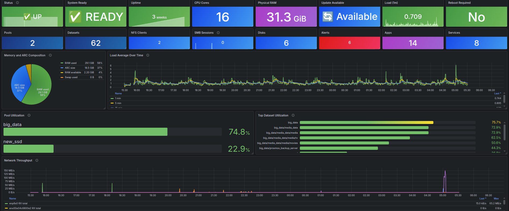
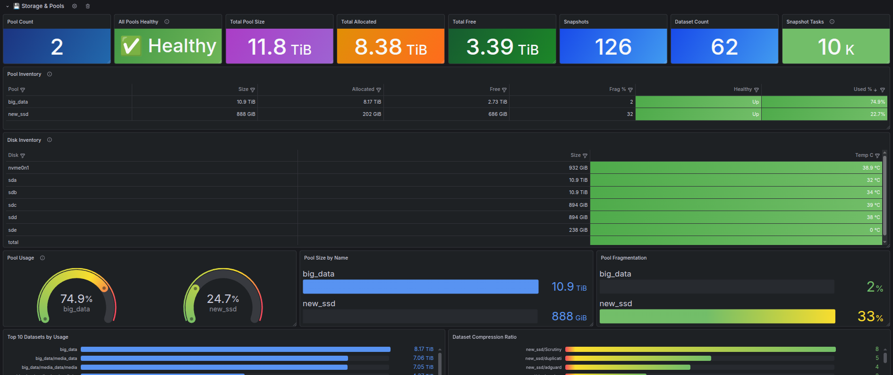
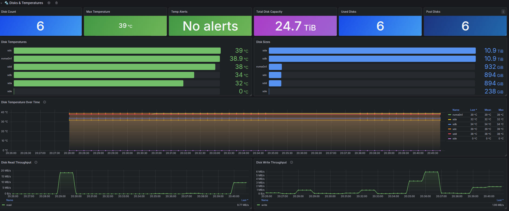
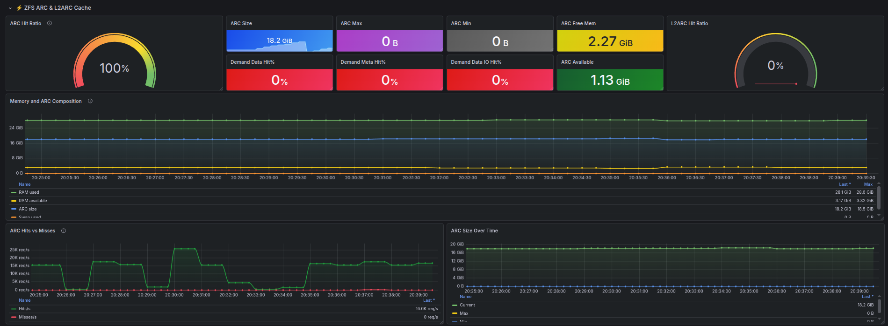
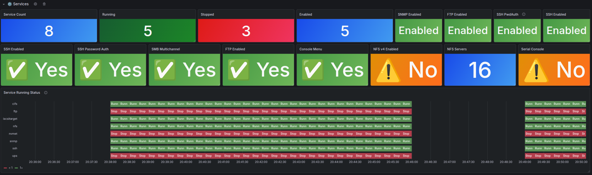
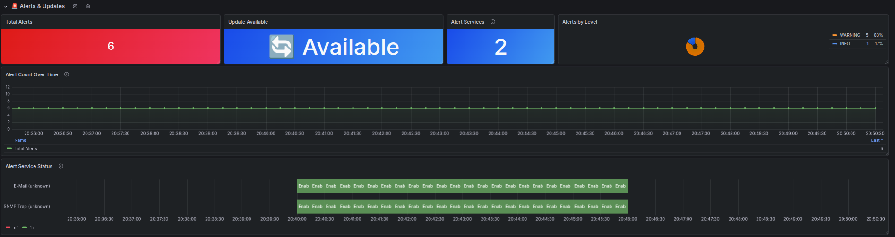

<div align="center">

# TrueNAS Prometheus Exporter

Standalone Prometheus exporter for the TrueNAS JSON-RPC WebSocket API, with Docker-first deployment, safe metric defaults, and an included Grafana dashboard.


[Quick start](#quick-start) • [Configuration](#configuration) • [Grafana dashboard](#grafana-dashboard) • [Testing](#testing)

</div>

Repository: `github.com/Unknowlars/truenas-scale-api-prometheus-exporter`



## Dashboard Preview

The repository includes a ready-to-import Grafana dashboard covering system health, storage pools, disks, ZFS cache, services, apps, tasks, alerts, and virtualization.

| Overview | Storage |
| --- | --- |
|  |  |

| Disks | ZFS ARC / L2ARC |
| --- | --- |
|  |  |

| Services | Alerts |
| --- | --- |
|  |  |

## Overview

TrueNAS Prometheus Exporter connects to a TrueNAS system over the JSON-RPC WebSocket API, collects inventory and state data, and exposes Prometheus metrics on `/metrics` with a lightweight `/healthz` endpoint for container health checks.

It is designed to be easy to run publicly and easy to operate:

- single-file Python exporter with minimal runtime dependencies
- Docker and Docker Compose friendly out of the box
- broad metric coverage across storage, hardware, services, tasks, and alerts
- event-driven realtime updates for streams such as `reporting.realtime`, `app.stats`, and `virt.instance.metrics`
- bundled Grafana dashboard JSON and dashboard generator source
- conservative defaults that keep higher-cardinality options disabled unless you opt in

> [!IMPORTANT]
> This exporter is currently maintained against TrueNAS SCALE `25.10.2`. Nearby versions may work, but collector coverage and default event subscriptions are tuned for that release.

## What You Get

- system identity, version, uptime, readiness, update, and reboot state
- pools, datasets, snapshots, scrub and resilver progress, and vdev errors
- CPU, memory, swap, disks, temperatures, network throughput, and ZFS ARC/L2ARC metrics
- SMB, NFS, iSCSI, NVMe-oF, services, apps, VMs, jobs, replication, and alerts
- exporter health signals such as API call failures and collector error counters

## Quick Start

### Option 1: Docker Compose

This is the fastest way to get the exporter running locally.

```bash
cp .env.example .env
# Edit .env and set TRUENAS_WS_URL and TRUENAS_API_KEY
docker compose up -d --build
curl http://localhost:9108/healthz
curl http://localhost:9108/metrics
```

Compose reads `.env` and publishes `EXPORTER_PORT` on the same host port by default.

### Option 2: Docker Image

Run the published container directly:

```bash
cp .env.example .env
docker pull ghcr.io/unknowlars/truenas-scale-api-prometheus-exporter:latest
docker run --rm \
  --env-file .env \
  -p 9108:9108 \
  ghcr.io/unknowlars/truenas-scale-api-prometheus-exporter:latest
```

> [!NOTE]
> Published image tags should include both `latest` and a fixed release tag such as `1.0.0`.

If you want to build the image locally instead, use:

```bash
docker build -t ghcr.io/unknowlars/truenas-scale-api-prometheus-exporter:latest .
```

### Option 3: Run Locally with Python

```bash
python3 -m venv .venv
. .venv/bin/activate
pip install -r requirements.txt
cp .env.example .env
python3 truenas_exporter.py
```

## Configuration

Everything supported by the exporter is documented in `.env.example`. These are the settings most users will care about first:

| Variable | Required | Description |
| --- | --- | --- |
| `TRUENAS_WS_URL` | yes | TrueNAS WebSocket API URL, for example `wss://truenas.example.local/api/current` |
| `TRUENAS_API_KEY` | yes | TrueNAS API key; use a read-only key |
| `TRUENAS_VERIFY_TLS` | no | Keep `true` in production; set `false` only for controlled testing |
| `EXPORTER_PORT` | no | HTTP port for `/metrics` and `/healthz`; default `9108` |
| `SCRAPE_INTERVAL_SECONDS` | no | Poll interval for regular collectors |
| `TRUENAS_TIMEOUT_SECONDS` | no | Timeout for API call batches |
| `LOG_LEVEL` | no | `DEBUG`, `INFO`, `WARNING`, or `ERROR` |
| `ENABLE_EVENT_STREAMS` | no | Enable background event subscriptions |
| `EVENT_SUBSCRIPTIONS` | no | Comma-separated event streams to subscribe to |
| `EVENT_INTERVAL_SECONDS` | no | Interval used for supported realtime streams |
| `ENABLE_DATASET_METRICS` | no | Enable dataset collectors |
| `ENABLE_TASK_METRICS` | no | Enable task collectors |
| `ENABLE_IPMI_METRICS` | no | Enable IPMI collectors when available |

> [!NOTE]
> Higher-cardinality and discovery-heavy options are intentionally conservative by default. Review `.env.example` before enabling settings such as `AUTO_DISCOVER_METHODS`, `SCRAPE_ALL_METRICS`, or filesystem list operations in production.

## Prometheus

Use `prometheus.truenas-example.yml` as a starting point, or add a scrape job like this:

```yaml
scrape_configs:
  - job_name: truenas_exporter
    scrape_interval: 30s
    static_configs:
      - targets:
          - truenas-exporter:9108
```

If Prometheus runs outside Docker, replace `truenas-exporter:9108` with the reachable host or IP of the exporter.

The repo also includes `docker-compose.prometheus.yml` and `prometheus.yml` for local experiments. Update those targets before publishing or using them outside your own environment.

## Grafana Dashboard

The repository includes a ready-to-import dashboard in `truenas-exporter-dashboard.json`.

1. Open Grafana and go to `Dashboards` -> `Import`.
2. Upload `truenas-exporter-dashboard.json`.
3. Choose your Prometheus data source.
4. Save the dashboard.

If you want to regenerate or extend the dashboard later, the source builder is `generate_truenas_dashboard.py`.

### Screenshot Assets for the README

README screenshots live in `.github/images/`, so you can refresh the visuals over time without changing the overall README structure.

## Included Files

| Path | Purpose |
| --- | --- |
| `truenas_exporter.py` | Exporter implementation |
| `Dockerfile` | Container image build |
| `docker-compose.yml` | Main Docker Compose deployment |
| `.env.example` | Example environment configuration |
| `prometheus.truenas-example.yml` | Minimal Prometheus scrape config |
| `truenas-exporter-dashboard.json` | Importable Grafana dashboard |
| `generate_truenas_dashboard.py` | Dashboard generator source |
| `tests/` | Unit tests for collector and event behavior |

## Testing

```bash
python3 -m venv .venv
. .venv/bin/activate
pip install -r requirements-dev.txt
pytest
python -m compileall truenas_exporter.py tests
```

The current automated tests focus on collector behavior, query shaping, and event subscription handling.

## Operational Notes

- `/healthz` confirms the exporter process is serving HTTP; it does not guarantee the last scrape succeeded
- some collectors only produce metrics when the related TrueNAS service or subsystem is enabled
- event-driven metrics depend on supported TrueNAS event streams and API behavior
- enabling discovery-heavy options can increase Prometheus series count quickly on large systems

## Troubleshooting

- verify that `TRUENAS_WS_URL` points to the TrueNAS WebSocket endpoint ending in `/api/current`
- confirm the API key can read the resources you expect to scrape
- if your TrueNAS instance uses a self-signed certificate, trust the CA where possible instead of disabling TLS verification
- check container logs with `docker compose logs -f truenas-exporter` when startup or authentication fails

If you hit a bug or want to request additional coverage, open an issue at `https://github.com/Unknowlars/truenas-scale-api-prometheus-exporter/issues` with your TrueNAS version, the relevant config toggles, and an example of the missing metric or API response.
